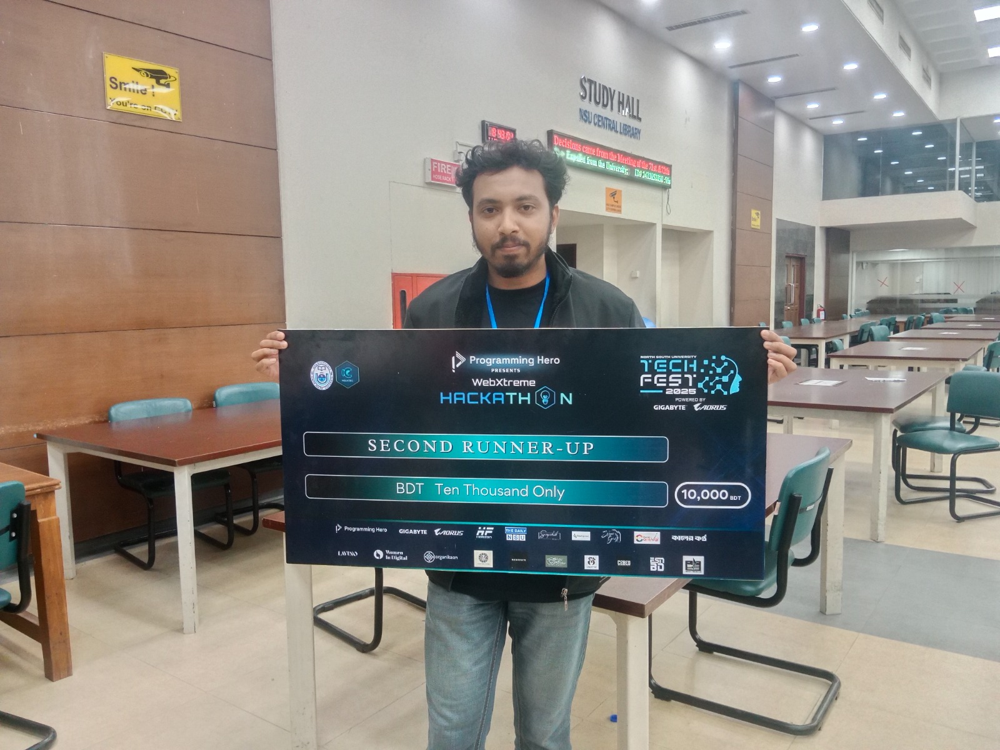

<details>
  <summary><b>🔒&nbsp;&nbsp;RSA&nbsp;Public&nbsp;Key</b></summary>
  <br/>

```
ssh-rsa AAAAB3NzaC1yc2EAAAADAQABAAABgQDTFwRyHmgz4VnZsvEuIPAjsyTU2nz6jx2J8RctmZUoVmycmoB+UOr3iDcZCswWhSqNChqtBHBf0Tg3KcP//7CZHFRjC037W01qdtDJJo5GdLDZ2Y3v09qDoZscyWN0oecMcNsDTrBRN+g7lZjxfjoRIsbwQftRoKU10eX9Uczk7TxJuG2AjAecftb9Z7W5TuytZ/KDY7NjcBSG4wJi3j0p3xCIKmhYY5+WGiw3mzxLu2n9+d5jM67cZ6M9omyOGxBxHKo5KydnHFIkNvxtVGDN0OkRh3iqmBuEG7Wpy9fQD2f/ZoD0bbNnB5Ej4TnwZs7X55u0tEEhWhxHSc8y4g6ick9CTQCGz2TgrNtpZzrR/OrFhHBfUTF3vcnmzwDTOxmGX9u770cYmcZXKFrbZQXLYZtDPFv9A5jgyEyBeoy03TA08ksZ8qDCb8CGPdFQ9NDG29/ASxFZ75zzD5K8ZRla9QW2kvI2RKWI8Jn+8gbReRpDhJ3qkEXBXGnUUWSO8R8= bdsumon4u@gmail.com
```
</details>
<details>
  <summary><b>🔒&nbsp;&nbsp;GPG&nbsp;Public&nbsp;Key</b></summary>
  <br/>

```
-----BEGIN PGP PUBLIC KEY BLOCK-----

mQINBGd1ecYBEAC6O/gyZagYE0J5v/NUFihozyw+NchMH2K5brnT2zyIVou7NIcp
WzTkovli9WgidjwWgj2QNIM6yAiEgJmYXfIZxtiBgNc3XiLu/nrDz23lbEByAjh7
rGDsOdA9e3YvjXnePZqST9RKWkB5NMOCQD0NYBrU9OGw59fE4z0hzW1nep1YQaVv
QJM5PzJ4chuXGRanI82ougf+ckC36tbSxsvFfPFH3u0oH6SOKUnnRfEX6X5qOW//
FC6F6WjtLRP1m7OR/B9LKQv/CR7LqWA8PuRGOBg9kMRdifePPXHBAyPfldfNa0DH
0KB06XszLF+4xrd2rByuwSfrineGKAKpKbj28zl5LH+GSZhV1KzarkqEMZjiDrMv
5MVO59JGbuO6QJ6rlmiJZbIkeV9l7bI+/LRuBM8pl5ZvC2OLKMVV9ahmxsr/XsYN
cq5bZSmBb8jj8UBSAPDQHGSfHhp+mqlV+pGhivw8Vv6Y5TKQICrcetBJkdzqSa1t
3kRak5xRmASksmJWlFRKbmPayoywSPgtj1EhZB32fiYS3r+ClAvOpuLqBDqATwRY
AydS+66bfapdOC8ZQahqnyghDPewL7XoUZeMEsoWTpijS70kAFBIsHi5s1P1tSSd
+PaZW5a42AUydN/dKr0N9q0f3z2r/j0uznJv0L5OVC9XI64/8bm6JEI7IQARAQAB
tCFTdW1vbiBBaG1lZCA8YmRzdW1vbjR1QGdtYWlsLmNvbT6JAlQEEwEIAD4WIQSa
UISeP3oipMqNttYb71QNV+fbiwUCZ3V5xgIbAwUJB4YfQwULCQgHAgYVCgkICwIE
FgIDAQIeAQIXgAAKCRAb71QNV+fbi5bnD/9Istvh7asCnoAoIxO41WKLGhwMLKQ8
qVQFDdTJpxLxqkHB1WtlzgUwqIWQMOffSW1Pqz+KAJrler/venHAhq+VrGxSGBYB
KFc/S0i9Yc7/6FgMT3V5p+mkQmzhT9BNiVnVSAaITo+9cOFvXKvH+L1PNohr3ymL
j1RlKP9K/p1ayd+ZHnsjA9kaVAq25v1GjuQMeji6xkzuU1KM4GhUgRoZUe68+B6l
wLxwH88N7vxp9sk/j0cUtSgFfRszVcePDVvLciHZlsyBaz1zf9gkLnbCU+daNyWN
w3rsN771IRG7wMejJtZq678/LE9lm/Uw5U24wTzzXpL9urE8D5G0Tzm/Ryt23PyI
ltDD1w6PpEiSrnyrxyCcVaOHKcW09oxdMjQBbFsNF3Vu6EQA9KFAjwulLK4sGUKm
IBdOQOMui3UTjYKA+BtYta+QyH4f+/89nZQshvonkCAxkkatCK1vLwtT+L+9w6+d
JqwD4uA9ByFhXpDGuRcJwtnb5neGCX+JOyxp08B20e0+yW82b5PgUjB1G/+ATC4u
GWiZSdjeA3REZ0ihxOdikSKAUOQdj5o0/Gh/44mmoE9KT4mWMRjk/V1FVXgkp9Is
wJdgrXHQW7gavxAZ5sxwoDdTJtJGRwgC5zN8zebuJ4xc7xc0y36NcAsNXD666j2r
eoBkmWNXo96ntbkCDQRndXnGARAA1P+0U8yVFyKVS4PaJd4aGYSjuJm/mbAFMDvv
gZjkPBaS3EcAey7ufoj+u0z3nhACNQLP5yiCcYYjuIPzn4POCI91buToXO4n0XSR
k9TtGIVtJUt8QRLaKVfxD2ZU7A9rMpWkjzHUX5Ot+XSMBy7IQJlZCMCGwSkI3CvO
tdOWRgEDa0gMN3tjIDS6aG65545ueGhyVi6cb0ohuGzDzulYz1e5mW7Q2FlpwuI/
avXVqkI82UyskVIamP44zshzrDjwj0a7XnuEiGmaxSWunbS7A41k9BfUNP8qMrCi
psdyDfQ7CVn5xdKXXROpHMyLa/lucKz1qlV82gb+uIrSxf0JzpQokJtavhvFjp12
3b5o436akZpksXwqMJuE/m5Sl2RaHSVkgROna26tVoaHH4ujIFQkfjQmctNCX+jd
YqSe2HqbsAw1vhktd3Sh1bd5iRpaQUdfJrtYtP8tuK+xz1c4vpX2j0uYVXnalQui
VdCoImuhzIjsoEEOODMzilAhEKdyaVGqMwUqNMaZfMyg98Y09PZ/Qcax7/FkjScH
B/2GgTCq5hXEvZn9EZm6fedE7bgUhnXuJazAm+UqOkeyZpiBzA7hYd9c06IaRuh6
/97cnD9PoZtqiFr29UfUaalC8Z6kCgrSdFQkNaIugu2UW8uBrgFIOIDiInVxQPD5
ZHA5zX0AEQEAAYkCPAQYAQgAJhYhBJpQhJ4/eiKkyo221hvvVA1X59uLBQJndXnG
AhsMBQkHhh9DAAoJEBvvVA1X59uLxuIP/jWIN35hmbVwJuh+WjoN/Cp9bkSoj2pw
blXsXS+uco8+1Oh7D09PDbrKeLCsNbKk3MUXHN7gKL5sIr8D/6YazRF3f+Z6jrZz
GcyIDh79Q9B97xJndJ+JxtU0oJICPopG3+IrPogoLqmGGbR1NRsz9V161Ww7WQ1+
jdih0RFs8pgZE/wtOmy5ZvoZdjWNCk1kE2k6Rmuw7cknphCO9QMx/M/8X4bxfz5f
l3l6/nFcf/QYGeNsbbJ3fUktwhrcLeASOtCOtuVhePTXCl5KVTnK270XKajFRVIw
Imy1Uzl8qkSw/UGIrB5Eug1pBt7e5cLIj7OvSiJuZuAbL0OwLrY5Wt3KzbbnOU46
ruREPELFxGYe9w+e2ZQZtSGjiNrfvclYIQOJlW3zSkIUX5sDvCF+C43or1+BKOUe
YQAnA3zBTkRfbeZjdi13ApTAkgUKPDeEuBFmyIOhmDmMtAoPpK4wtf2DOT3+IZy0
Vfk7cNvmcJIxYqQofcBvraDc7Ir5hrfSfNcinam5MfRkTrdycOLXvF/NXoLzGF6m
2CUhNcrXJAsYYMHw2g6GuCJME+7fM6DaoydUrlhKK2XvW9xofnnpMrDu2U+1Xssf
Eq53WdnwTDeyFN8vmHhRt0iVNOK4lFOYxoBXa41Rm6uveCoJxwM2+la6ohQj3edn
vlAd1yFkDJdt
=sjsB
-----END PGP PUBLIC KEY BLOCK-----
```
</details>

# 𝐻𝑒𝓁𝓁𝑜  𝐼'𝓂 𝓢𝓾𝓶𝓸𝓷 𝓐𝓱𝓶𝓮𝓭
𝙁𝙪𝙡𝙡 𝙎𝙩𝙖𝙘𝙠 𝙙𝙚𝙫𝙚𝙡𝙤𝙥𝙚𝙧 𝙛𝙧𝙤𝙢 𝘽𝙖𝙣𝙜𝙡𝙖𝙙𝙚𝙨𝙝, 𝙘𝙪𝙧𝙧𝙚𝙣𝙩𝙡𝙮 𝙨𝙩𝙪𝙙𝙮𝙞𝙣𝙜 𝘾𝙤𝙢𝙥𝙪𝙩𝙚𝙧 𝙎𝙘𝙞𝙚𝙣𝙘𝙚 𝙖𝙣𝙙 𝙀𝙣𝙜𝙞𝙣𝙚𝙚𝙧𝙞𝙣𝙜 𝙖𝙩 𝙩𝙝𝙚 𝙐𝙣𝙞𝙫𝙚𝙧𝙨𝙞𝙩𝙮 𝙤𝙛 𝙍𝙖𝙟𝙨𝙝𝙖𝙝𝙞.

[](https://facebook.com/bdsumon4u)
[](https://twitter.com/bdsumon4u)
[](https://linkedin.com/in/bdsumon4u)
[](https://codeforces.com/profile/bdsumon4u)
[](https://leetcode.com/bdsumon4u)
[](https://github.com/bdsumon4u)
[](mailto:bdsumon4u@gmail.com)
[](https://hotash.tech)

𝑰 ❤️ 𝑩𝒂𝒄𝒌𝒆𝒏𝒅 𝑫𝒆𝒗𝒆𝒍𝒐𝒑𝒎𝒆𝒏𝒕 𝒘𝒊𝒕𝒉 𝘓𝘢𝘳𝘢𝘷𝘦𝘭

:computer: 𝑨 𝒘𝒆𝒃 𝒅𝒆𝒗 𝒆𝒏𝒕𝒉𝒖𝒔𝒊𝒂𝒔𝒕 𝒘𝒊𝒕𝒉 𝒂 𝒑𝒂𝒔𝒔𝒊𝒐𝒏 𝒇𝒐𝒓 𝘓𝘢𝘳𝘢𝘷𝘦𝘭.

💡 𝑷𝒂𝒔𝒔𝒊𝒐𝒏𝒂𝒕𝒆 𝒂𝒃𝒐𝒖𝒕 𝒃𝒓𝒊𝒏𝒈𝒊𝒏𝒈 𝒊𝒅𝒆𝒂𝒔 𝒕𝒐 𝒍𝒊𝒇𝒆. 𝑬𝒙𝒑𝒍𝒐𝒓𝒆 𝒂𝒍𝒍 𝒐𝒇 𝒎𝒚 𝒑𝒓𝒐𝒋𝒆𝒄𝒕𝒔.

## 𝗖𝘂𝗿𝗿𝗲𝗻𝘁𝗹𝘆 𝘄𝗼𝗿𝗸𝗶𝗻𝗴 𝗼𝗻

[](https://github.com/bdsumon4u/HotashKom)
[](https://github.com/bdsumon4u/iUddokta)

## 🚀 Successful Projects  

<details open>
  <summary>📌 <strong>HotashKom</strong></summary>

  - **Description:**
  This is a full fledge E-Commerce application.
  - **🔴 This project is being used by <span style="color:red">hundreds</span> of clients!**  
  - **GitHub Repo:** [🔗 Repository Link](https://github.com/bdsumon4u/HotashKom)
  - **Live Demo:** 🌍 [ecom.cyber32.net](https://ecom.cyber32.net)
  - **Used Technologies/Tools:**  
    
    
    
    
    
    
    
    
    
    
    

</details>

<details>
  <summary>📌 <strong>iUddokta</strong></summary>

  - **Description:** It's a cool project for wholesale and dropshipping.
  - **GitHub Repo:** [🔗 Repository Link](https://github.com/bdsumon4u/iUddokta)
  - **Live (Not a Demo):** - 🌍 [iuddokta.com](https://iuddokta.com)
  - **Used Technologies/Tools:**  
    
    
    
    
    
    
    
    
    

</details>

<details>
  <summary>📌 <strong>Work32</strong></summary>

  - **Description:** A cool project for internal workflow management of Cyber 32.
  - **GitHub Repo:** [🔗 Repository Link](https://github.com/bdsumon4u/work32)
  - **Live (Not a Demo):** 🌍 [work.cyber32.com](https://work.cyber32.com)
  - **Used Technologies/Tools:**  
    
    
    
    
    
    
    

</details>

<details open>
  <summary>📌 <strong>Site32</strong></summary>

  - **Description:** This cool project automatically updates HotashKom's new features/fixes to hundreds of clients' websites if the client has a maintenance package on Cyber 32's WHMCS portal.
  - **GitHub Repo:** [🔗 Repository Link](https://github.com/bdsumon4u/sites)
  - **Live (Not a Demo):** 🌍 [sites.cyber32.net](https://sites.cyber32.net)
  - **Used Technologies/Tools:**  
    
    
    
    
    
    
    
    
    
    
    

</details>

> **🟡 AND:** some other [] projects.

## ✨ Open-Source Contributions  

I rarely contribute to open-source projects. Here are some insignificant contributions:  

| 🔹 Project                                                                      | 🔹 Contribution |
|---------------------------------------------------------------------------------|-----------------|
| **[filamentphp/filament](https://github.com/filamentphp/filament)**             | BugFix: redundant column prefixing in table summaries ([#17274](https://github.com/filamentphp/filament/pull/17274)) |
| **[Filament Menu Builder](https://github.com/datlechin/filament-menu-builder)** | Bug fixes & feature improvements ([#30](https://github.com/datlechin/filament-menu-builder/pull/30)) |
| **[Laravel Splade](https://github.com/protonemedia/laravel-splade)**            | Event support on Bridge component ([#433](https://github.com/protonemedia/laravel-splade/pull/433)) |
| **[Laravel Fortify](https://github.com/laravel/fortify)**                       | Added Response contract bindings ([#425](https://github.com/laravel/fortify/pull/425)) |
| **[Laravel Jetstream](https://github.com/laravel/jetstream)**                   | Raised issue on EmailVerificationTest ([#425](https://github.com/laravel/jetstream/issues/755)) |
| **[Laravel Framework](https://github.com/laravel/framework)**                   | Reported for a missing doc ([#425](https://github.com/laravel/framework/commit/e45b94e8242e1789d6f9cdb0e3ae7fa1c6189ca0)) |
| **Other Contributions** | [My GitHub Contributions](https://github.com/pulls?q=author%3Abdsumon4u) | Various PRs & issue fixes |

> 💡 _Check out my full list of contributions on_ [GitHub Pull Requests](https://github.com/pulls?q=author%3Abdsumon4u). 🚀  

## 🏆 Achievements

<details open>
  <summary>🎯 <strong>Hackathon Success - WebXtreme 2025</strong></summary>

  - **Event:** [Programming Hero](https://www.programming-hero.com) Presents WebXtreme Hackathon 2025
  - **Position:** 2nd Runner Up 🥉
  - **Host:** North South University, Dhaka
  - **Team:** RU_Codatron, 4 classmates collaborative effort. We're 3rd among 320+ teams from 75+ institutions.
  
  

</details>

## 🚀 My Tech Stack

### 🔹 Backend & API Development


### 🔹 Frontend & UI Libraries


### 🔹 Databases & Caching


### 🔹 DevOps & CI/CD


### 🔹 Authentication & Security


### 🔹 Testing & Code Quality


### 🔹 Tools & Hosting


## 📊 GitHub Stats 📈
[](https://github.com/bdsumon4u)
[](https://github.com/bdsumon4u)

<!---
bdsumon4u/bdsumon4u is a ✨ special ✨ repository because its `README.md` (this file) appears on your GitHub profile.
You can click the Preview link to take a look at your changes.
--->
